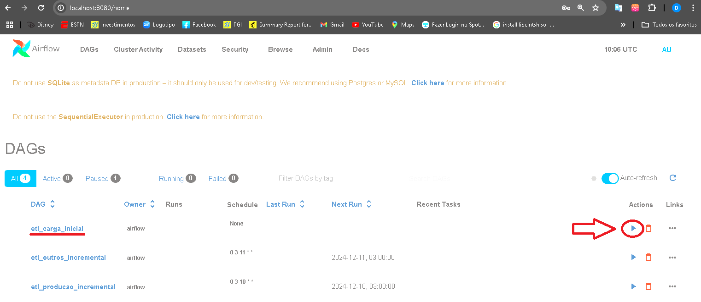

# Info-APS
Informações de produção da atenção primária brasileira, utilizando os dados disponibilizados pelo governo brasileiro, no sistema de informação em saúde para a atenção básica (SISAB).

## Introdução

Este projeto tem como objetivo disponibilizar informações sobre a atenção básica na saúde pública no Brasil de forma clara e acessível, promovendo a transparência e a democratização dos dados. Utilizamos ferramentas de análise de dados e visualização para criar dashboards interativos que permitem a melhor compreensão dos dados.


## Metodologia
Para atingir nosso objetivo, utilizamos uma metodologia baseada em três pilares: coleta, análise e visualização de dados.

1. **Coleta de Dados**: Realizada a partir de fontes abertas disponíveis no site [SISAB](https://sisab.saude.gov.br/), que fornece informações sobre os atendimentos de atenção básica.
2. **Análise de Dados**: Comparação dos valores entre diferentes níveis geográficos (nacional, estadual e municipal) e ao longo de trimestres e anos.
3. **Visualização de Dados**: Utilização de ferramentas de visualização de dados para criar dashboards interativos e visualizações personalizadas.


## Pré-requisitos
Antes de começar, certifique-se de ter os seguintes pré-requisitos instalados em seu sistema:

- **Docker**: Plataforma para desenvolvimento, envio e execução de aplicações em containers. Você pode instalar o `Docker` seguindo as instruções no site oficial: [Docker Installation](https://docs.docker.com/get-docker/).

- **Docker Compose**: Ferramenta para definir e executar aplicativos Docker multi-container. Você pode instalar o `Docker Compose` seguindo as instruções no site oficial: [Docker Compose Installation](https://docs.docker.com/compose/install/).

## Instalação

Para instalar o projeto, siga os passos abaixo:

1. Clone o repositório:
   ```sh
   git clone https://gitlab.com/schulzdanielf/saude-basica.git
    ```

2. Acesse o diretório do projeto:
    ```sh
    cd saude-basica
    ```

3. Construa o container do projeto:
    ```sh
    docker-compose build
    ```

## Execução

1. Execute o container do projeto:
    ```sh
    docker-compose up
    ```

2. **Acesse o link do painel no navegador:**

    👉 [**Link do Painel**](http://localhost:8020)


## Carga Inicial dos Dados

Para realizar uma carga completa na base de dados, siga os passos abaixo:

1. Acesse o Airflow no navegador:

    👉 [**Link do Airflow**](http://localhost:8080)

2. Clique no botão `Trigger DAG` para iniciar a carga inicial dos dados.
    

3. Aguarde, o processo de carga pode levar algumas horas.

    
## Contribuição

Contribuições são sempre bem-vindas! Se você deseja contribuir com o projeto, siga os passos abaixo:

1. Faça um fork do projeto
2. Crie uma nova branch (`git checkout -b feature/nova-feature`)
3. Faça o commit das suas alterações (`git commit -am 'Adiciona nova feature'`)
4. Faça o push para a branch (`git push origin feature/nova-feature`)
5. Crie um novo Pull Request

## Licença

Este projeto está licenciado sob a Licença MIT - veja o arquivo [LICENSE](LICENSE) para mais detalhes.


## Contato

Para suporte ou dúvidas, entre em contato conosco:

| <div style="text-align: center;"></div> | <div style="text-align: center;"></div> | <div style="text-align: center;"></div> | <div style="text-align: center;"></div> | <div style="text-align: center;"></div> |
|:------------------------------------------:|:-------------------------------------------:|:---------------------------------------------:|:-----------------------------------------:|:---------------------------------------------:|
| **Daniel Schulz**                          | **Elinilson Vital**                         | **Leonardo Gomes**                            | **Lucas Macedo**                          | **Mariana Cruvinel**                          |
| danielfs0@hotmail.com                      | vital@usp.br                                | leonardogomes@ime.usp.br                      | lucnunmacedo@usp.br                        | mariana.valerio2@hotmail.com                  |
| [LinkedIn](https://www.linkedin.com/in/daniel-schulz-ab59a0150/) | [LinkedIn](https://www.linkedin.com/in/elinilson-vital-437b81/) | [LinkedIn](https://www.linkedin.com/in/leosilvagomes/) | [LinkedIn](https://www.linkedin.com/in/lucnun/) | [LinkedIn](https://www.linkedin.com/in/mariana-cruvinel/) |


## Estrutura de diretórios
```
.
├── Makefile # Arquivo de automação de tarefas
├── README.md # Documentação do projeto
├── analises # Análises de dados
├── docker-compose.yml # Arquivo de configuração do Docker Compose
├── docs # Documentação do projeto
│   └── variaveis-validacao.md
├── etl # Extração, transformação e carregamento dos dados
│   ├── main.py # Script principal para iniciar o ETL
├── modelos
│   └── database
├── painel # Aplicação Web com Dash para visualização dos dados
│   ├── Dockerfile
│   ├── app.py # Arquivo principal
│   ├── assets # Diretório de arquivos estáticos
│   ├── callbacks # Diretório de callbacks
│   ├── data # Diretório de dados
│   ├── pages # Diretório de páginas
│   ├── requirements.txt # Requisitos do projeto
│   └── static # Diretório de arquivos estáticos
├── requirements.txt # Requisitos do projeto
└── tests # Testes do projeto
```
